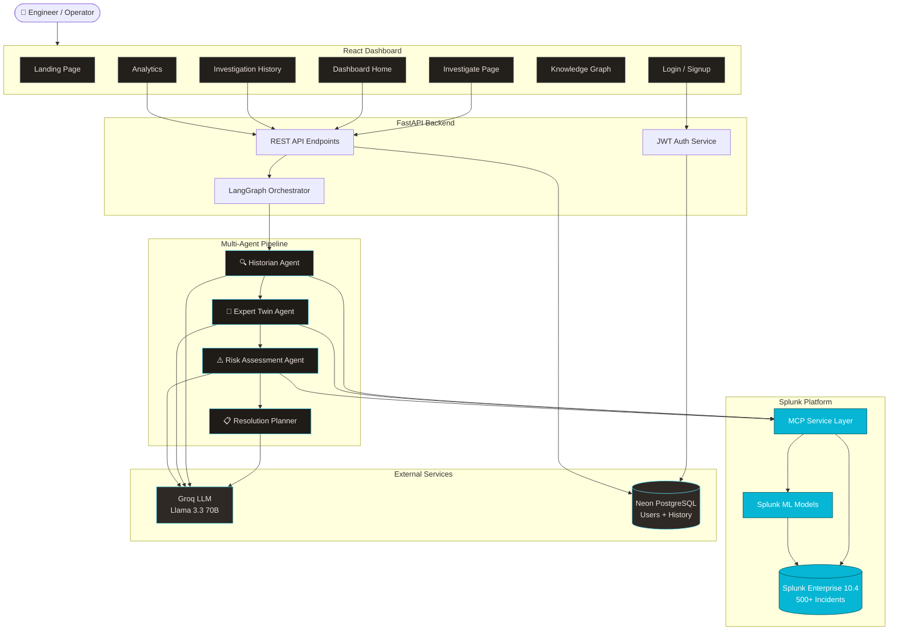
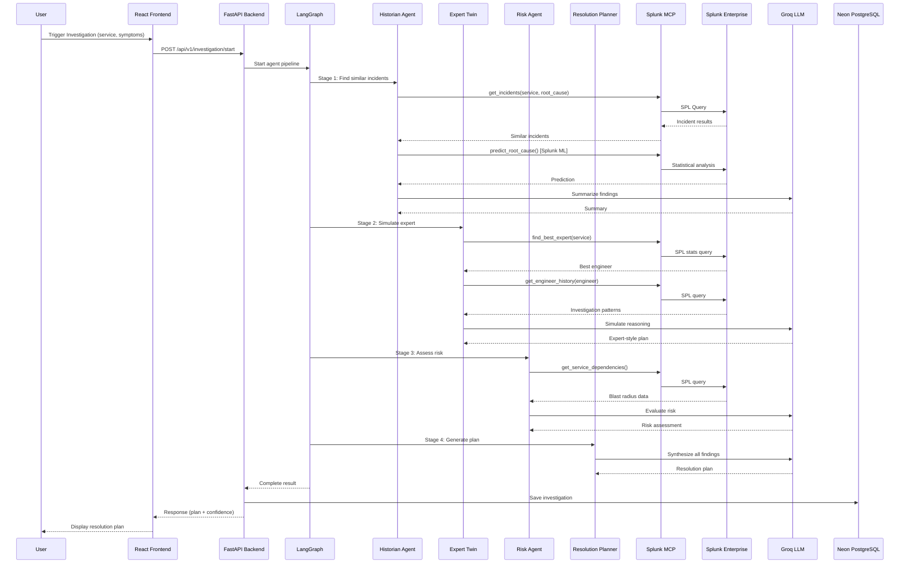

# OpsTwin AI — Architecture Diagram

---

## Data Flow Summary

---

## Component Responsibilities

| Component | Technology | Responsibility |
|-----------|-----------|----------------|
| Frontend | React + Tailwind | User interface, investigation trigger, results display |
| Backend API | FastAPI | Auth, routing, orchestration entry point |
| LangGraph | Python | Sequential agent pipeline management |
| Historian | Agent | Search operational memory, detect anomalies |
| Expert Twin | Agent | Simulate expert engineer reasoning |
| Risk Agent | Agent | Evaluate blast radius, rank actions |
| Planner | Agent | Merge findings into executable plan |
| MCP Layer | Python service | Sole Splunk access interface for all agents |
| Splunk ML | SPL commands | Anomaly detection, prediction, MTTR estimation |
| Splunk Enterprise | Data platform | 500+ incidents, operational data storage |
| Groq LLM | Llama 3.3 70B | Reasoning, summarization, plan generation |
| Neon PostgreSQL | Database | User accounts, investigation persistence |
