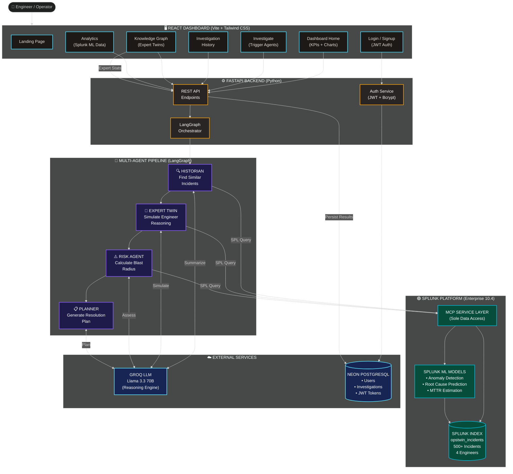

# OpsTwin AI — Architecture Diagram

---

## Investigation Flow (Sequence)

```mermaid
%%{init: {'theme': 'dark', 'themeVariables': {'fontSize': '14px'}}}%%
sequenceDiagram
    participant U as 👤 User
    participant FE as 🖥️ Frontend
    participant BE as ⚙️ Backend
    participant H as 🔍 Historian
    participant ET as 🧠 Expert Twin
    participant RA as ⚠️ Risk Agent
    participant RP as 📋 Planner
    participant MCP as 🟢 Splunk MCP
    participant ML as 📊 Splunk ML
    participant LLM as 🤖 Groq LLM
    participant DB as 💾 Neon DB

    U->>FE: Select service + symptoms + severity
    FE->>BE: POST /api/v1/investigation/start
    BE->>H: Stage 1 — Search operational memory

    rect rgb(30, 27, 75)
        Note over H,MCP: HISTORIAN AGENT
        H->>MCP: get_incidents(redis-cluster, memory_leak)
        MCP-->>H: 5 similar incidents found
        H->>ML: predict_root_cause(redis-cluster, P1)
        ML-->>H: memory_leak (50% probability)
        H->>ML: detect_anomaly(redis-cluster)
        ML-->>H: Anomaly detected (z=2.4)
        H->>LLM: Summarize findings
        LLM-->>H: "Pattern matches INC-0142..."
    end

    H->>ET: Pass findings →

    rect rgb(88, 28, 135)
        Note over ET,MCP: EXPERT TWIN AGENT
        ET->>MCP: find_best_expert(redis-cluster)
        MCP-->>ET: alex_chen (175 incidents)
        ET->>MCP: get_engineer_history(alex_chen)
        MCP-->>ET: Investigation patterns
        ET->>LLM: Simulate alex_chen reasoning
        LLM-->>ET: "Check memory first, then fragmentation ratio..."
    end

    ET->>RA: Pass findings →

    rect rgb(120, 53, 15)
        Note over RA,MCP: RISK ASSESSMENT AGENT
        RA->>MCP: get_service_dependencies(redis-cluster)
        MCP-->>RA: 3 downstream services
        RA->>MCP: get_recent_errors(redis-cluster)
        MCP-->>RA: 2 P1 incidents this week
        RA->>LLM: Assess blast radius
        LLM-->>RA: "Medium risk, 3 services affected"
    end

    RA->>RP: Pass findings →

    rect rgb(6, 78, 59)
        Note over RP,LLM: RESOLUTION PLANNER
        RP->>LLM: Synthesize all agent findings
        LLM-->>RP: 5-step resolution plan (87% confidence)
    end

    RP-->>BE: Complete result
    BE->>DB: Save investigation to PostgreSQL
    BE-->>FE: JSON response
    FE-->>U: Display plan + confidence + agent details
```

---

## Component Matrix

| Layer | Component | Technology | Responsibility |
|-------|-----------|-----------|----------------|
| **Frontend** | Dashboard | React + Vite + Tailwind | Interactive UI for all pages |
| **Frontend** | Auth | JWT in localStorage | Login, signup, protected routes |
| **Backend** | API Server | FastAPI (Python) | REST endpoints, auth, orchestration |
| **Backend** | Orchestrator | LangGraph | Sequential 4-agent pipeline |
| **Agents** | Historian | Python + Splunk MCP + LLM | Find similar incidents, run ML predictions |
| **Agents** | Expert Twin | Python + Splunk MCP + LLM | Simulate expert investigation patterns |
| **Agents** | Risk Agent | Python + Splunk MCP + LLM | Calculate blast radius, rank actions |
| **Agents** | Planner | Python + LLM | Merge findings into executable plan |
| **Data** | Splunk MCP | Custom Python service | Sole interface between agents and Splunk |
| **Data** | Splunk ML | SPL (z-score, stats, perc) | Anomaly detection, prediction, MTTR |
| **Data** | Splunk Enterprise | v10.4, Developer License | 500+ incidents across 4 engineers |
| **Data** | Neon PostgreSQL | Cloud database | Users, JWT, investigation history |
| **AI** | Groq | Llama 3.3 70B | Summarization, reasoning, plan generation |
